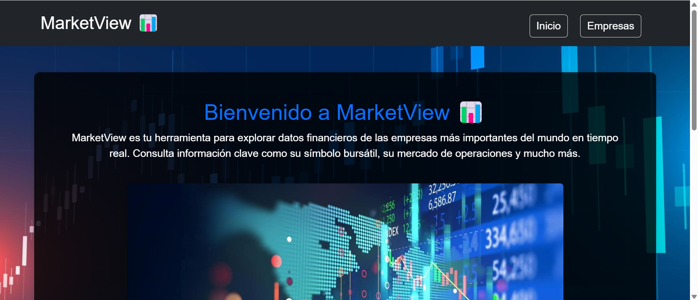
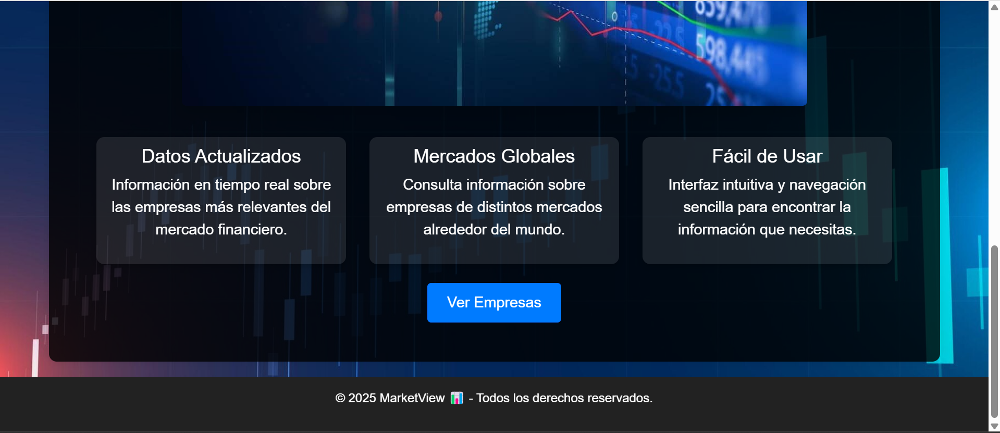
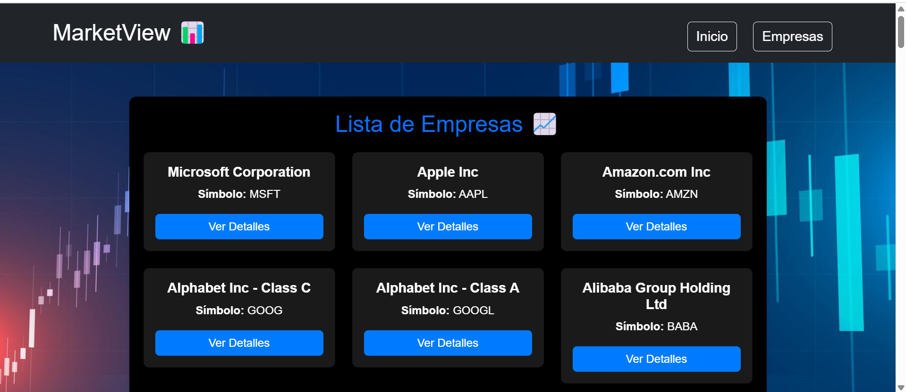
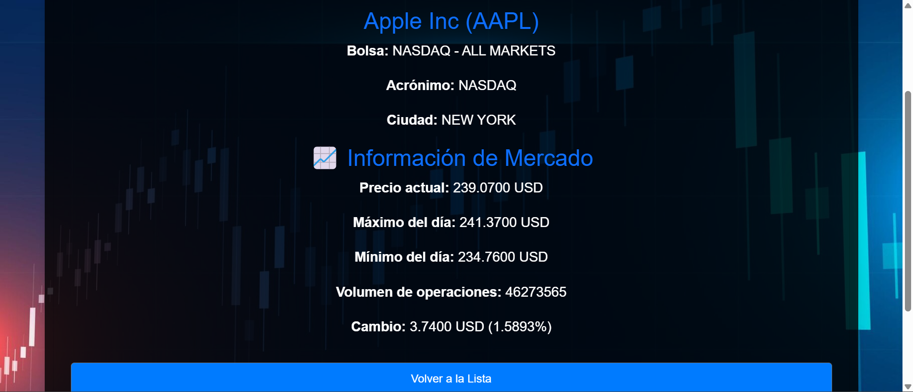

# MarketView - Aplicación de Análisis Financiero 📊

## 📌 Descripción
MarketView es una aplicación desarrollada en Angular que permite visualizar información de empresas del mercado financiero, incluyendo sus precios en tiempo real y detalles de cotización.

## 🚀 Tecnologías Utilizadas
- Angular
- TypeScript
- Bootstrap
- APIs: MarketStack y Alpha Vantage

## 📥 Instalación y Ejecución
1. **Clonar el repositorio**  
   git clone https://github.com/LuisAngel67/MarketView-App.git

   cd MarketView-App

2. **Instalar dependencias** 

npm install

3. **Ejecutar la aplicación** 

ng serve

4. **Abrir en el navegador** 

http://localhost:4200/

A continuación, algunas imágenes de la aplicación en funcionamiento:

